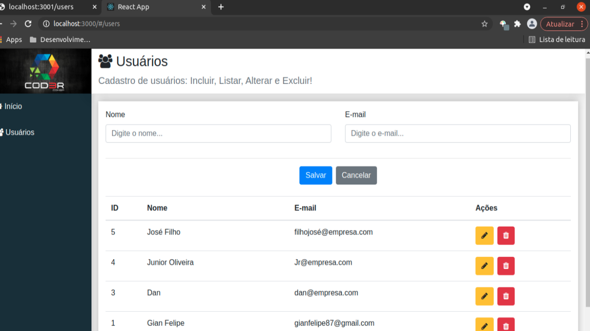

<h2 align="center">
    Primeiro projeto em React!
</h2>

 

## 🎯 Objetivo
Projeto desenvolvido durante o curso de Web Developer moderno da [Cod3r](https://www.cod3r.com.br/).

## 🚀 Tecnologia

Esse projeto foi desenvolvido com: [React](https://reactjs.org)

## 💻 Projeto

O projeto é um crud simples de usuário, utilizando json-server como backend e bootstrap para estilização.

---

## License 
Projeto de estudo desenvolvido por [Gian Felipe](https://github.com/Gian-f) | [MIT License](./LICENSE).
 
 
  
## Exemplo da aplicação

